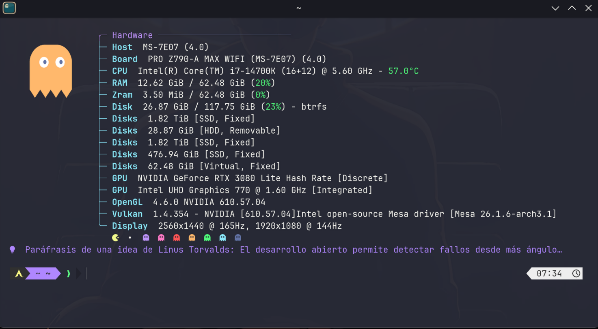
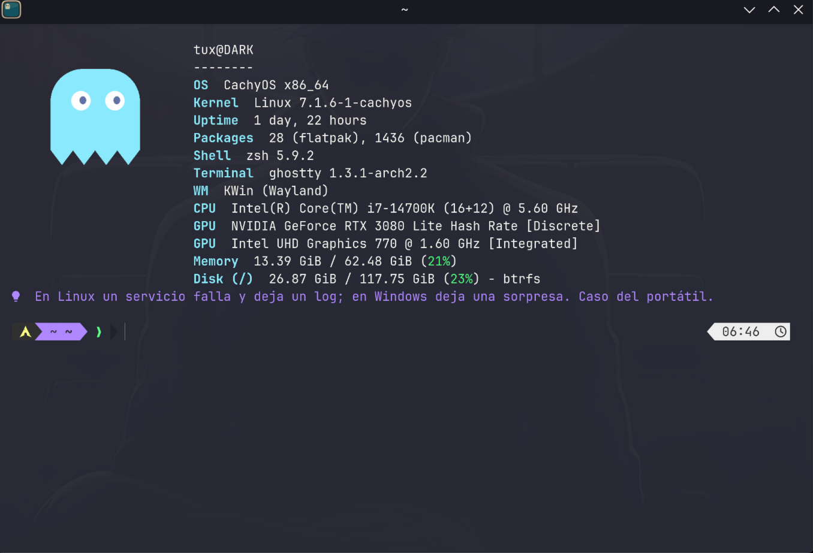
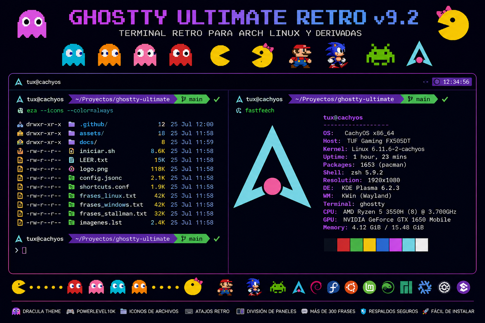

# Ghostty Ultimate Retro v10.0.0



Configuración modular para **Ghostty + Zsh + Powerlevel10k + Fastfetch**, con
estética Dracula y rotación automática de imágenes retro.

El proyecto fue creado y probado principalmente para **CachyOS**. También
incluye soporte para distribuciones derivadas de Arch Linux y soporte
adaptado para Debian/Ubuntu y Fedora. La disponibilidad de Ghostty y algunos
paquetes depende de los repositorios de cada distribución.

## Características

- Tema Dracula oficial como estilo predeterminado.
- Temas alternativos: Catppuccin Mocha, Tokyo Night, Nord, Gruvbox Dark,
  Everforest Dark y Kanagawa Wave.
- Prompt Powerlevel10k con directorio, Git, estado del comando y reloj.
- `eza` con iconos para directorios y tipos de archivo.
- `bat` con colores Dracula.
- Fastfetch con panel de hardware inspirado en la estética retro de la captura
  de referencia y colores oficiales de Dracula.
- Perfiles compacto, medio y grande elegidos automáticamente según las
  columnas y filas disponibles en la terminal.
- Imágenes proporcionales de `10×5`, `14×7` o `18×9` celdas para evitar
  deformaciones y mantener visible todo el contenido.
- Rotación aleatoria basada únicamente en las imágenes presentes en
  `~/.config/fastfetch/images/`, incluida en cada nueva terminal.
- Información de Host, placa, CPU y temperatura, RAM, Zram, discos, GPU,
  OpenGL, Vulkan y pantallas.
- Fila decorativa de Pac-Man y fantasmas con la paleta Dracula.
- Ventanas nuevas con tamaño inicial de 109 columnas por 22 filas.
- Citas aleatorias ajustadas al ancho disponible para evitar saltos de línea.
- Atajos para pestañas, divisiones, navegación y redimensionado.
- Copiar con `Ctrl+C` cuando hay selección y conservar `SIGINT` cuando no la hay.
- Copias de seguridad antes de modificar configuraciones.
- Restauración del respaldo más reciente.
- Validación de Ghostty, Zsh, Fastfetch y temas.
- Instalador consciente de la distribución.

## Distribuciones compatibles

| Familia | Estado | Gestor |
|---|---|---|
| CachyOS | Principal y recomendada | `pacman` |
| Arch Linux | Compatible | `pacman` |
| EndeavourOS | Compatible | `pacman` |
| Manjaro | Compatible con advertencias de repositorio | `pacman` |
| Debian | Adaptado; Ghostty depende de la versión/repositorio | `apt` |
| Ubuntu y derivadas | Adaptado; Ghostty depende de la versión/repositorio | `apt` |
| Fedora | Adaptado; Ghostty depende de la versión/repositorio | `dnf` |

En Debian, Ubuntu o Fedora, el instalador no compila Ghostty ni agrega
repositorios externos. Si `ghostty` no está disponible en los repositorios
habilitados, el instalador conserva el resto de la configuración y muestra
una advertencia para instalar Ghostty por un método oficial.

## Paquetes utilizados

### Esenciales

- `ghostty`
- `zsh`
- `git`
- `eza`
- `bat`
- `fastfetch`
- `fontconfig`

### Arch/CachyOS

Además utiliza:

- `ttf-jetbrains-mono-nerd`
- `zsh-autosuggestions`
- `zsh-syntax-highlighting`

En Debian/Fedora, Powerlevel10k y los complementos de Zsh se instalan en el
directorio del usuario mediante Git para evitar depender de nombres de
paquetes distintos entre distribuciones.

## Qué modifica

El instalador puede crear o reemplazar:

```text
~/.config/ghostty/
~/.config/fastfetch/
~/.config/ghostty-ultimate/
~/.zshrc
~/.p10k.zsh
~/.local/bin/ghostty-theme
~/.local/bin/ghostty-fastfetch
~/.local/share/powerlevel10k/
~/.local/share/ghostty-ultimate/plugins/
```

Antes de modificar archivos crea un respaldo en:

```text
~/.local/state/ghostty-ultimate/backups/
```

No modifica particiones, Btrfs, LUKS, snapshots ni el gestor de arranque.

## Instalación

Descomprime el proyecto:

```bash
unzip Ghostty-Ultimate-Retro-v10.0.0.zip
```

Entra en el directorio:

```bash
cd Ghostty-Ultimate-Retro-v10.0.0
```

Revisa las instrucciones:

```bash
less LEER.txt
```

Ejecuta el menú:

```bash
bash iniciar.sh
```

Ruta recomendada:

1. Ejecutar **Diagnóstico previo**.
2. Ejecutar **Instalación guiada completa**.
3. Revisar los avisos antes de instalar paquetes.
4. Cerrar todas las ventanas de Ghostty.
5. Volver a abrir Ghostty.
6. Ejecutar la validación desde el menú.

## Menú

```text
1) Diagnóstico previo
2) Instalar solo paquetes faltantes
3) Aplicar o reinstalar configuraciones
4) Instalación guiada completa
5) Validar instalación actual
6) Seleccionar tema
7) Seleccionar perfil de Fastfetch
8) Restaurar el respaldo más reciente
9) Mostrar respaldos
10) Cambiar shell de inicio a Zsh
0) Salir
```

## Imágenes

Fastfetch detecta automáticamente todos los archivos PNG dentro de:

```text
~/.config/fastfetch/images/
```

Puedes eliminar imágenes que no quieras utilizar o añadir otras nuevas.
No existe una lista fija de nombres. Mientras quede al menos una imagen
válida, la rotación seguirá funcionando.

La imagen se selecciona de nuevo al abrir cada terminal. Fastfetch adapta su
tamaño al espacio disponible:

| Perfil | Condición aproximada | Imagen |
|---|---|---|
| Compacto | Menos de 90 columnas o 24 filas | `10×5` celdas |
| Medio | Menos de 145 columnas o 32 filas | `14×7` celdas |
| Grande | 145 columnas y 32 filas o más | `18×9` celdas |

Las dimensiones usan una relación 2:1 porque una celda de terminal es más alta
que ancha. Esto mantiene proporcionados los PNG cuadrados. Si el directorio no
contiene imágenes, Fastfetch muestra el panel sin logo en lugar de fallar.

Al reinstalar las configuraciones, el instalador reemplaza el contenido del
directorio de imágenes por las imágenes incluidas en este proyecto.

## Fastfetch adaptativo

Los tres perfiles comparten el mismo panel de hardware y la paleta Dracula:

- Púrpura `#BD93F9` para el título.
- Cian `#8BE9FD` para las etiquetas.
- Blanco `#F8F8F2` para los valores.
- Verde `#50FA7B`, amarillo `#F1FA8C`, naranja `#FFB86C` y rojo `#FF5555`
  para porcentajes y temperaturas.
- Azul comentario `#6272A4` para separadores y detalles secundarios.

El perfil se decide al abrir la terminal usando `COLUMNS` y `LINES`. La imagen
aleatoria se inserta en el perfil elegido y las citas demasiado largas se
recortan con puntos suspensivos para conservar una presentación ordenada.

## Capturas

### Panel de hardware adaptativo


### Perfil clásico de Fastfetch



### Vista original de Ghostty Ultimate Retro



## Atajos de teclado

| Acción | Atajo |
|---|---|
| Copiar selección / SIGINT | `Ctrl+C` |
| Pegar | `Ctrl+V` |
| Copiar alternativo | `Ctrl+Shift+C` |
| Pegar alternativo | `Ctrl+Shift+V` |
| Crear división | `Ctrl+Alt+Flechas` |
| Mover foco entre paneles | `Ctrl+Shift+Flechas` |
| Panel anterior/siguiente | `Ctrl+Page Up` / `Ctrl+Page Down` |
| Cerrar panel | `Ctrl+Shift+W` |
| Zoom del panel | `Ctrl+Shift+Enter` |
| Igualar paneles | `Ctrl+Alt+=` |
| Redimensionar panel | `Ctrl+Alt+Shift+Flechas` |
| Nueva ventana | `Ctrl+Shift+N` |
| Nueva pestaña | `Ctrl+Shift+T` |
| Pestaña siguiente/anterior | `Ctrl+Tab` / `Ctrl+Shift+Tab` |
| Cerrar ventana | `Ctrl+Alt+W` |
| Recargar configuración | `Ctrl+Shift+R` |
| Paleta de comandos | `Ctrl+Shift+P` |
| Subir/bajar historial | `Shift+Page Up` / `Shift+Page Down` |
| Inicio/final del historial | `Ctrl+Shift+Home` / `Ctrl+Shift+End` |

## Comandos de Zsh

```text
ll       listado detallado con iconos y Git
la       archivos visibles y ocultos
tree     árbol de directorios con iconos
ff       ejecutar Fastfetch
gtheme   abrir selector de temas
```

## Restauración

Ejecuta:

```bash
bash iniciar.sh
```

Selecciona:

```text
8) Restaurar el respaldo más reciente
```

## Validación

Ejecuta:

```bash
bash iniciar.sh
```

Selecciona:

```text
5) Validar instalación actual
```

## Estructura del proyecto

```text
.
├── assets/                 imágenes que rotará Fastfetch
├── bin/                    scripts del instalador
├── config/
│   ├── fastfetch/          perfiles JSONC
│   ├── ghostty/            configuración y temas
│   └── zsh/                zshrc y Powerlevel10k
├── docs/                   documentación adicional
├── quotes/                 frases aleatorias
├── screenshots/            capturas para GitHub
├── ghostty-ultimate.sh     menú principal
├── iniciar.sh              punto de entrada
├── LEER.txt                guía rápida
└── README.md               documentación de GitHub
```

## Seguridad

- No se ejecuta una actualización completa del sistema automáticamente.
- Los paquetes se instalan solo después de confirmación.
- Los archivos del usuario se respaldan antes de reemplazarlos.
- Los scripts no usan `curl | sh`.
- No se agregan repositorios de terceros.
- Los repositorios Git utilizados se clonan dentro del directorio del usuario.
- El cambio de shell requiere confirmación independiente.

## Fuentes técnicas

- Documentación oficial de Ghostty: `https://ghostty.org/docs`
- Instalación oficial: `https://ghostty.org/docs/install/binary`
- Configuración: `https://ghostty.org/docs/config`
- Temas: `https://ghostty.org/docs/features/theme`
- Integración de shell: `https://ghostty.org/docs/features/shell-integration`
- Especificación oficial de Dracula: `https://draculatheme.com/spec`
- Proyecto Dracula: `https://github.com/dracula/dracula-theme`
- Powerlevel10k: `https://github.com/romkatv/powerlevel10k`

## Licencia

Los scripts y la documentación se distribuyen bajo la licencia MIT.
Consulta `ASSETS-LICENSE.md` antes de redistribuir las imágenes.
